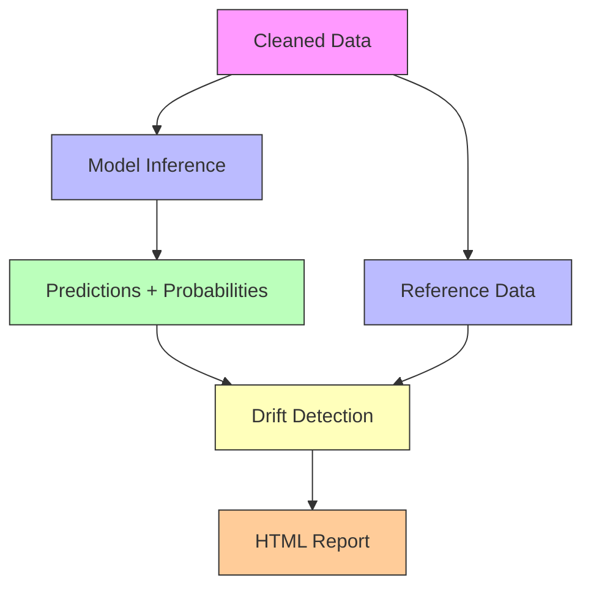

# 🕵️‍♂️ BreeBoost – Real-Time Fraud Detection & Monitoring


[](https://www.python.org/)
[](LICENSE)
[]()
[]()
[](https://github.com/evidentlyai/evidently)

> End-to-end machine learning pipeline for fraud detection with **real-time simulation**, **data drift monitoring**, and **interactive dashboards**.

---

## 🗂️ Project Structure

```text
breeboost/
├── src/
│   ├── inference.py            # Model inference logic
│   ├── utils/
│   │   └── logger.py           # Logging utility
│   └── ...
├── monitoring/
│   ├── reference.csv           # Clean data from training
│   ├── production.csv          # New data + predictions
│   ├── report.py               # Drift detection script
│   └── reports/
│       └── report.html         # Generated drift report
├── data/
│   └── processed/
│       └── paysim_cleaned.csv  # Cleaned dataset
├── app.py                      # Streamlit fraud dashboard
├── requirements.txt
└── README.md
```

---

## 📊 Architecture Overview



---

## ✅ Features Implemented

### 🔍 1. **Fraud Detection Model**

* Trained XGBoost classifier
* Input validation and prediction interface
* Outputs label + fraud probability

### 💻 2. **Streamlit Dashboard**

* Simulate transactions with input form
* View prediction results and probabilities
* Visualize important features and correlations

### 📈 3. **Evidently Drift Monitoring**

* Compares training vs production data
* Visualizes drift for numerical features
* Outputs full HTML diagnostics

🔗 **[View Latest Drift Report](monitoring/reports/data_drift_20250617_123717.html)**

---

## 🚀 Usage

### 🔧 Install Requirements

```bash
pip install -r requirements.txt
```

### 🧠 Run Inference

```bash
python src/inference.py
```

### 🧾 Generate Reference Dataset

```bash
python src/utils/extract_ref.py
```

### 📦 Simulate Production Data

Use the dashboard or inference module to generate rows for `production.csv`.

### 📉 Run Drift Monitoring

```bash
python monitoring/report.py
```

### 🖥️ Launch Streamlit App

```bash
streamlit run app.py
```

---

## 🔢 Key Features for Drift Detection

* `amount`, `oldbalanceOrg`, `newbalanceOrig`
* `errorBalanceOrig`, `errorBalanceDest`
* `hour`, `day`, `is_large_transaction`

---

## 📦 Requirements

* Python 3.8+
* pandas, xgboost, joblib
* evidently, seaborn, matplotlib
* streamlit

Install everything:

```bash
pip install -r requirements.txt
```

---

## 🛣️ Roadmap

* [ ] Performance drift monitoring (F1, recall)
* [ ] Notification triggers (e.g. Slack alerts)
* [ ] CI/CD with GitHub Actions
* [ ] Dockerization + cloud deployment
* [ ] Add feature importance explanation (e.g. SHAP)

---

## 📌 Notes

* Run scripts from the project root for relative paths to resolve.
* Check `monitoring/reports/report.html` regularly to evaluate input stability.
* You can customize the model threshold and feature set in `inference.py`.

---

## 📜 License

This project is licensed under the [MIT License](LICENSE).

---
